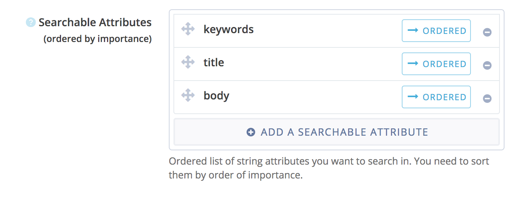

# Power search using Algolia

Use Algolia as a back-end to index and search your book's content.

This plugins requires gitbook `>=3.0.0`.

## How to use it?

### Create an Algolia account

1. Sign up to [Algolia](https://www.algolia.com)
2. Set up a basic index.
3. Access your [API keys settings](https://www.algolia.com/api-keys), and keep this page open for the next steps.

### Set up the plugin in your book.

1. Open Settings > Plugins Store interface in the GitBook Editor.
2. Install the `algolia` plugin.
3. Specify the following values in the modal for your book:
    * **Algolia Index Name**, which is the name of the index you set up in Algolia web.
    * **Algolia Application ID**, which is your unique application ID for API identification.
    * **Algolia Search-Only API Key**, which is the unique ID for search queries.
    * **Is your Algolia account free**, which you leave as `true` if you have what Algolia call a "Hacker Account".

Or if you prefer, you can declare the plug-in values in the `book.json` file. Add the plugin and its configuration to your `book.json`:

```JSON
{
    "plugins": ["algolia"],
    "pluginsConfig": {
        "algolia": {
            "index": "algolia-index-name",
            "applicationID": "algolia-application-id",
            "publicKey": "algolia-search-only-api-key",
            "freeAccount": "true"
        }
    }
}
```

### Set Algolia Environment Variables

If you are using the GitBook Editor, you can specify the `ALGOLIA_PRIVATEKEY` in the Settings of your book.

1. Login to https://www.gitbook.com
2. Go to the `Settings` of the book you want to add the environment variable to.
4. Scroll down to the `Environment Variables` group.
5. Add a new variable, named `ALGOLIA_PRIVATEKEY`, and put your **Admin API Key** as value.

If you are using the command line, pass your **Admin API Key** as an environment variable when launching gitbook:

```Bash
$ ALGOLIA_PRIVATEKEY="algolia-admin-api-key" gitbook serve
```

#### A note about the index

**WARNING** The plugin will replace the entire index at each build phase. Do not use an existing index, unless you no longer require its contents.

When setting up the basic index on Algolia, you will be prompted to generate or import the index so Algolia can begin analysing your book.

You do not need to create the index manually for the plugin to work.


### Adding keywords to a page

You can specify explicit keywords for any page.

```md
---
search:
    keywords: ['keyword1', 'keyword2', 'etc.']

---

# My Page

This page will rank better if we search for 'keyword1'.
```

### Disabling indexing of a page

You can disable the indexing of a specific page by adding a YAML header to the page:

```md
---
search: false
---

# My Page

This page is not indexed in by Algolia.
```

### Fine tuning the Algolia search rankings

After having indexed your book at least once, you can configure your Algolia index from your [dashboard](https://www.algolia.com/explorer). You can go to the _Ranking_ settings and tell Algolia how to search your pages. You can see below an example configuration, that tells Algolia to search, by order of importance, the keywords of your pages, their title, and finally their content (body).


